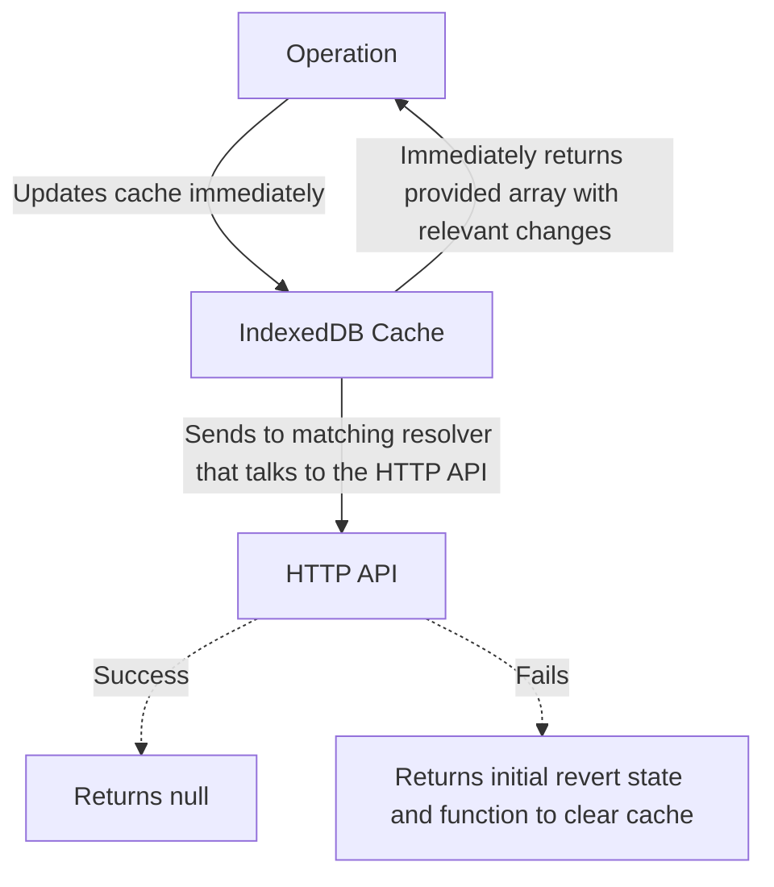
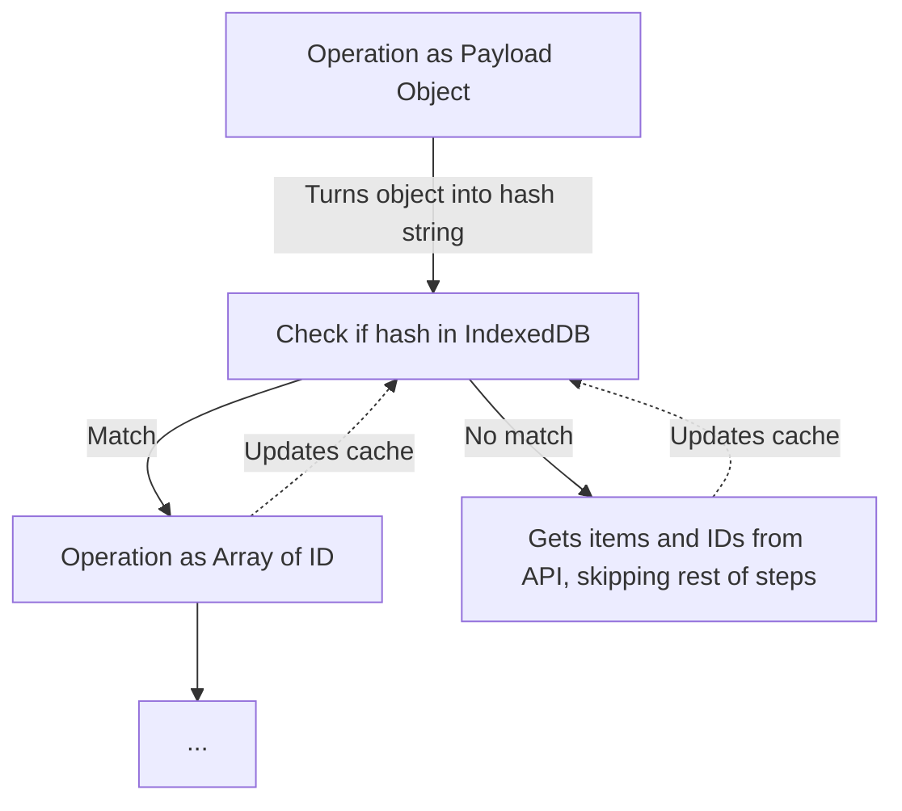

# 🛸 OCRUD

**Offline Create-Read-Update-Delete interface built on top of the native browser IndexedDB API.**

_Note that this is still a proof of concept. You are welcome to use the code for inspiration, however it is not advised to use as is in your own codebase_

## Creation

A collection is created with the `createCollection` factory function. It takes the following properties on creation:

- `name`: The name of the list, usually corresponds to the actual items in the list. I.e. `products` , `users` , etc.
- `version` : Any unique string that defines the most recent version. It is recommended that the version be changed when any changes are made to the logic or shape of the items in the store, in order to prevent new assumptions conflicting with older cached items. Do not be scared to have users re-create the cache upon changes. The overhead to creating a new cache is neglibable compared to the prospect of incorrect assumptions about cached data.
- `debug`: An optional boolean value. If set to true then the collection object will will log to the console each of the following steps for an operation:
    - The operation name, with the action that was passed to the operation
    - Resolution of the data promise, with the result.
    - Completion of the validation, with information whether it passed or failed.
- `resolvers` is an object with four method, each associated with an operation. The resolvers object is covered in more detail below.

The creation factory function takes two generics:

- `Item` : Defines the shape of objects listed in the collection. `id` property is required to be a unique identifier.
- `Payload` : Possible payload objects that can be dispatched by the `read` operation. These objects are converted into an array of item ID values by the API.

See below how a collection is created with an example "API" object:

```ts
import * as types from "./App.types";
import { createCollection } from "./ocrud";

const delay = (value: any) => new Promise((resolve) => {
  setTimeout(() => resolve(value), 8000)
})

const calcIfFail = () => Math.random() < 0.1
const calcIfAdd = () => Math.random() < 0.2
const calcIfDelete = () => Math.random() < 0.2
const calcIfChange = () => Math.random() < 0.2

export const API = {
  tasks: [
    {
      title: "Example Task #1 ",
      completed: false,
    },
    {
      title: "Example Task #2 ",
      completed: false,
    },
    {
      title: "Example Task #3 ",
      completed: false,
    },
  ].map(toItem),

  addTask(newTask: types.Task) {
    if (calcIfFail()) return { status: 'fail' }
    this.tasks = [newTask, ...this.tasks];
    return delay({ status: 'success' })
  },

  deleteTask(id: types.ID) {
    if (calcIfFail()) return { status: 'fail' }
    this.tasks = this.tasks.filter(item => item.id !== id);
    return delay({ status: 'success' })
  },

  toggleTask(id: types.ID) {
    if (calcIfFail()) return { status: 'fail' }

    this.tasks = this.tasks.map((item) =>
      item.id !== id ? item : { ...item, completed: !item.completed }
    );

    return delay({ status: 'success' })
  },

  getTasks(page: number) {
    if (calcIfFail()) return { status: 'fail' }
    const randomId = this.tasks[Math.floor(Math.random() * this.tasks.length)].id
    const newId = Math.random() * 100000000000000000

    if (calcIfAdd()) {
        this.addTask({
            id,
            title: `Example Task #${id}`,
        })
    }

    if (calcIfChange()) toggleTask(randomId)
    if (calcIfDelete()) deleteTask(randomId)


    const start = (page - 1) * 10;
    return delay({ status: 'success', items: this.tasks.slice(start, 10), count: this.tasks.length });
  },
};

export const collection = createCollection<types.Task, { page: number }>({
  name: "tasks",
  version: "167eb992-d5e9-4c23-959e-c30df69d8b18",
  debug: true,

  resolvers: {
    create: async ([newTask]) => API.addTask(value);
    deletion: async ([id]) => API.deleteTask(value);

    update: async ([partialItem]) => {
      if (!partialItem.id || partialItem.completed === undefined)
        throw new Error("No item");

      const value: any = await delay(partialItem.id)
      return API.toggleTask(value);
    },

    read: async (action) => {
      if (Array.isArray(action)) throw new Error("Invalid request");
      const { items, count } = API.getTasks(value);

      return {
        items,
        meta: { count },
      };
    },
  },
});
```

## Interface

The `createCollection` factory returns the following object that exposes the primary interface by which the collection is interacted with. It contains the following methods (of which four are the traditional CRUD operations).

*Note that “delete” is replaced with “deletion” since, “delete” is a reserved word in JavaScript*

- `create` : Accepts an array of items to add to the collection. Will be added at front.
- `read` : Accepts an array of string ID values for items to retrieve. Can also accept an object payload that includes instructions to be resolved by the API to return matching items.
- `update` : Accepts an array of items will optional properties to update, the only required property is the ID which is used to find the item to update.
- `deletion`: Accepts an array of string ID values that match items to be removed from the collection.

### Create, Update and Delete

Generally creating, updating and deleting are pretty straight-forward. The logic can be summarised as follows:

- The operations accepts the following arguments:
    - An array of ID’s or objects that is used to update the collection
    - An optional list of items to be modified if/as relevant (this usually coincides with something that is currently tracked in React state).
- When the operation is called the provided list of items is immediately returned with the changes applied (if applicable).
- The following then happens in the background:
    - The collection cache is updated with the requested changes as well.
    - The matching async resolver callback is also fired.
- If the resolver returns true then it is considered a success, and nothing happens.
- If the resolver returns false, then an object is returned with the following:
    - `revert`: The initial list of items supplied before it was updated. This allows rolling back to a state of before the operation was called.
    - `clear` a function that can be called to clear the cache. This is useful if you want to do a new request to sync the Model and Viewmodel.



### Read

The `read` operation is a bit trickier, purely because it makes a distinction between item matches in the cache and query matches in the cache.

These concerns are can briefly be described as follows:

- `Items` which are objects in the cache representing the last know state of an item in the collection. These are called and cached alongside a unique ID value.
- `Payload`

### Array of ID Values

The simplist case can be explained as follows:

- If you pass an array of string ID values it will merely find matches for those items in the cache and return them. It will call the `read` resolver in the background to ensure the HTTP API matches what got returned by the cache.
- If it matches what is in the cache then nothing will be done.
- If it does not match what is in the cache it will return an array of the updated values returned from the Model (while updating the cache)
- If it does not find matches for all IDs in the cache it attempt to fetch directly from the HTTP API (updating the cache on response), which means that it will take longer than a cached response.

```mermaid
graph TD;

O[Operation as Array of ID]
C[IndexedDB Cache]
D[HTTP API]
R[Returns Cache Array]
A[Returns from API Items]
E[Returns function to clear, retry or revert]

O --> C
C -- Match --> R
C -- No match --> D
R -. Updates cache in background .- C
D -. Success --> A
A -. Updates cache in background .- C
D -- Fail --> E
```

### Payload Object

However, the specific required ID values are not always know. If the actual items to be shown (for example in filtering, searching or sorting) is calculated by the HTTP API then an payload object is passed (to be interpreted by the `read` resolver). This specific object is convered into a string hash (note the order of properties), and the matching Item ID values are saved in the cache alongside this hash. 

These ID values will then be used when the same payload is supplied again. Once the payload returns an array of ID values, the same process as above is followed. However with the exception that background updating of the cache is not run again since it will be fired by the payload object itself already.



## Terminology

- **Item**: a single object in the list maintained by a _collection_
- **Match**: an array of _item ID_ values that maps to _queries hashes_.
- **Meta**: an object where additional response information from a query can be stored. All _meta_ objects map to specific _query hashes_ 

- **List** an array of objects that all have the same shape/keys. Effectively an array of _items_.
  
- **Collection**: an object that exposes _operations_ that interface with IndexedDB on a user's machine in order to store and update cached information about list sourced from a _target API_. A _collection_ stores all known _item_, _match_ and _meta_ information internally.

- **Target API**: The assumed actual source of truth that is able to return up-to-date _query results_ and _matches_ (to be cached in the _collection_).

- **Anomalies**: Inconsistencies that are identified between the _collection_ and _target API_, these might be content that has changed remotely since the last time a `read` operation ran, or failures to write to the _target API_ after the local store has been updated. Anomalies usually results in some type of reverting of UI state.

- **Operations**: Four different methods that are exposed by a _collection_ object. These correspond to a traditional CRUD model, in other words: `create`, `read`, `update` and `deletion`. All operations return a tuple that contains two promises. The first: a response that represent the actual known data currently saved in the _collection_. If the data is not available then this falls back to a direct request to the _target API_. The second promise is merely validates wether there are any _anomalies_ in the data between the _collection_ and _target API_.


